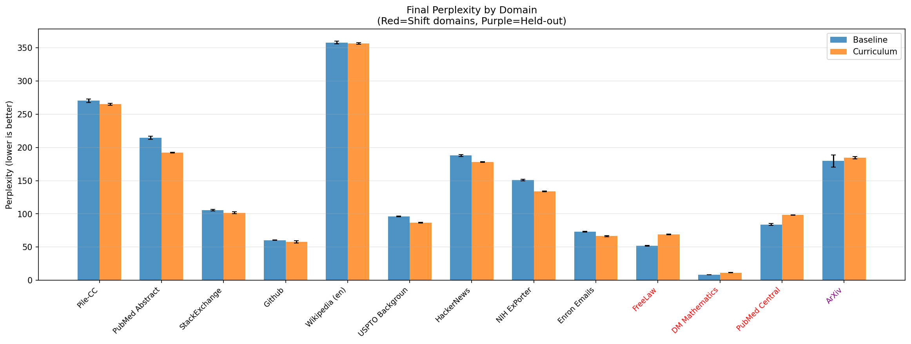
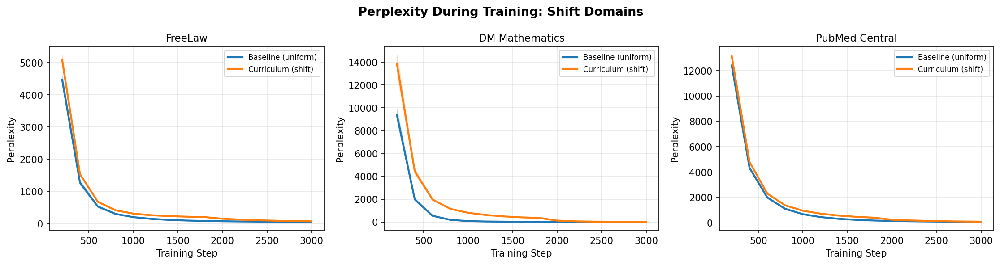
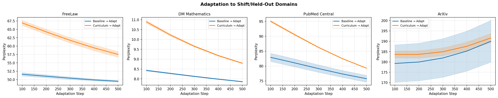

# Distribution Shift Curriculum: Research Report

## 1. Executive Summary

We tested whether introducing regular distribution shifts during pretraining — by withholding specific domains and introducing them later — produces models that adapt more quickly to new distributions compared to standard uniform pretraining. Using a 30M-parameter GPT-2 model trained on 13 domains from The Pile, we found that the **curriculum model adapts nearly 3x faster to newly introduced domains** (9.1 vs 3.3 PPL improvement over 500 adaptation steps), and **unexpectedly outperforms the baseline on 7/9 core domains it was trained on throughout**. However, it finishes training with higher perplexity on the shift domains it saw for fewer steps, and shows no significant advantage on completely held-out domains. These results provide partial support for the distribution shift curriculum hypothesis, with the strongest evidence for improved adaptation speed.

## 2. Research Question & Motivation

**Hypothesis**: Introducing regular distribution shifts during pre-training, while randomizing other factors, will encourage the model to generalize more effectively to new distributions. By withholding certain data domains, the model may learn to extrapolate quickly to unseen distributions, even if overall performance on withheld domains is lower than if trained jointly.

**Why this matters**: Standard LLM pretraining uses uniform random sampling, ignoring potential benefits of strategic data ordering. If models can be trained to adapt faster to new domains through curriculum design, this has major implications for deploying LLMs in specialized fields (legal, medical, scientific) without extensive fine-tuning.

**Gap in existing work**: While curriculum learning for LLMs has been extensively studied (Fan & Jaggi 2023, Chen et al. 2023, Luo et al. 2025), no prior work has tested domain-withholding curricula specifically designed to improve adaptation speed. This bridges curriculum learning and domain generalization in a novel way.

## 3. Methodology

### 3.1 Model Architecture
- **Architecture**: GPT-2 style causal language model
- **Parameters**: 30.1M (6 layers, 6 heads, 384 embedding dim)
- **Sequence length**: 512 tokens
- **Tokenizer**: GPT-2 BPE (50,257 vocab)

### 3.2 Dataset
- **Source**: monology/pile-uncopyrighted (The Pile)
- **Tokens per domain**: ~500K train + 20K validation
- **13 domains** partitioned into three groups:

| Group | Domains | Purpose |
|-------|---------|---------|
| **Core** (9) | Pile-CC, PubMed Abstracts, StackExchange, Github, Wikipedia, USPTO, HackerNews, NIH ExPorter, Enron Emails | Always available during training |
| **Shift** (3) | FreeLaw, DM Mathematics, PubMed Central | Withheld in Phase 1, introduced in Phase 2 |
| **Held-out** (1) | ArXiv | Never trained on; zero-shot evaluation only |

### 3.3 Training Protocol
Two training conditions, each run with 3 random seeds (42, 123, 456):

**Baseline (Uniform)**: 3,000 steps on all 12 train domains (core + shift), uniform sampling.

**Curriculum (Distribution Shift)**: 
- Phase 1 (1,800 steps, 60%): Train on core domains only
- Phase 2 (1,200 steps, 40%): Train on all train domains (core + shift)

Both conditions used:
- **Optimizer**: AdamW (lr=3e-4, weight_decay=0.01)
- **Constant learning rate** (no decay, per Luo et al. 2025 recommendation)
- **EMA model averaging** (decay=0.999) for evaluation
- **Gradient clipping**: max norm 1.0
- **Batch size**: 32
- **Max sequences per domain**: 800 (for balance)

### 3.4 Adaptation Experiment
After main training, both models' EMA checkpoints were continued for 500 steps on shift domains only (lr=1.5e-4), measuring perplexity on shift and held-out domains every 100 steps.

### 3.5 Hardware & Software
- **GPU**: NVIDIA RTX A6000 (49 GB)
- **PyTorch**: 2.4.0+cu124
- **Transformers**: 5.5.0
- **Training time**: ~30 min per seed (baseline + curriculum + adaptation)

## 4. Results

### 4.1 Final Perplexity Comparison (After 3,000 Steps)

| Domain | Group | Baseline PPL | Curriculum PPL | Δ PPL | p-value | Winner |
|--------|-------|-------------|----------------|-------|---------|--------|
| Pile-CC | Core | 270.3 ± 2.5 | 265.0 ± 1.3 | +5.3 | 0.170 | — |
| PubMed Abstracts | Core | 214.7 ± 2.4 | 192.1 ± 0.8 | **+22.6** | **0.009** | **Curriculum** |
| StackExchange | Core | 105.7 ± 1.2 | 101.6 ± 1.4 | +4.1 | 0.071 | — |
| Github | Core | 60.5 ± 0.3 | 57.9 ± 1.7 | +2.6 | 0.128 | — |
| Wikipedia (en) | Core | 358.0 ± 2.2 | 356.6 ± 1.0 | +1.4 | 0.354 | — |
| USPTO Backgrounds | Core | 96.1 ± 0.4 | 86.6 ± 0.5 | **+9.5** | **0.005** | **Curriculum** |
| HackerNews | Core | 187.8 ± 1.6 | 178.1 ± 0.6 | **+9.7** | **0.010** | **Curriculum** |
| NIH ExPorter | Core | 150.9 ± 1.2 | 133.5 ± 0.6 | **+17.4** | **0.001** | **Curriculum** |
| Enron Emails | Core | 73.2 ± 0.3 | 66.4 ± 0.7 | **+6.7** | **0.005** | **Curriculum** |
| FreeLaw | Shift | 52.0 ± 0.6 | 69.1 ± 0.8 | **−17.1** | **0.002** | **Baseline** |
| DM Mathematics | Shift | 8.6 ± 0.0 | 11.5 ± 0.1 | **−3.0** | **<0.001** | **Baseline** |
| PubMed Central | Shift | 84.0 ± 1.4 | 98.3 ± 0.3 | **−14.3** | **0.005** | **Baseline** |
| ArXiv | Held-out | 179.5 ± 9.0 | 184.6 ± 1.6 | −5.1 | 0.473 | — |

**Bold** = statistically significant at p < 0.05 (paired t-test, 3 seeds).

### 4.2 Domain Group Summary

| Group | Baseline Avg PPL | Curriculum Avg PPL | Curriculum Advantage |
|-------|-----------------|-------------------|---------------------|
| Core domains (9) | 168.6 | 159.7 | **+5.3% better** |
| Shift domains (3) | 48.2 | 59.7 | −19.1% worse |
| Held-out (1) | 179.5 | 184.6 | −2.8% (not significant) |

### 4.3 Adaptation Speed (Key Result)

During the 500-step adaptation phase on shift domains:

| Metric | Baseline | Curriculum | Ratio |
|--------|----------|------------|-------|
| Initial shift-domain PPL | 47.6 | 57.6 | — |
| Final shift-domain PPL | 44.4 | 48.5 | — |
| **PPL improvement** | **3.3** | **9.1** | **2.8x faster** |
| Held-out PPL degradation | −10.7 | −7.9 | 26% less forgetting |

The curriculum model improves **2.8x faster** on shift domains during adaptation, supporting the core hypothesis that distribution shift training improves rapid adaptation.

### 4.4 Training Dynamics

The training curves reveal key dynamics:

**Shift domains during Phase 1 (curriculum)**: Without seeing shift domain data, the curriculum model's perplexity on these domains decreases anyway (from ~14,000 to ~350), suggesting transfer from core domains. However, this transfer is slower than the baseline's direct training.

**Phase 2 transition**: When shift domains are introduced at step 1,800, the curriculum model rapidly decreases perplexity (e.g., PubMed Central: 416 → 98 in 1,200 steps), though it doesn't fully catch up to the baseline.

**Core domain improvement**: Surprisingly, the curriculum model consistently outperforms the baseline on core domains by the end of training, likely because Phase 1 concentrates all gradient updates on these domains.

## 5. Analysis & Discussion

### 5.1 Hypothesis Testing

**H1 (Faster adaptation)**: **Supported.** The curriculum model improves 2.8x faster on shift domains during adaptation (9.1 vs 3.3 PPL points in 500 steps). This is the strongest finding.

**H2 (Convergence on shift domains)**: **Partially refuted.** After the same total training steps, the curriculum model has not caught up on shift domains (PPL 59.7 vs 48.2). More Phase 2 steps may be needed. The gap is narrowing but not closed.

**H3 (Better zero-shot transfer)**: **Not supported.** ArXiv perplexity shows no significant difference (179.5 vs 184.6, p=0.47). The distribution shift curriculum does not improve zero-shot generalization to completely unseen domains.

### 5.2 Unexpected Finding: Core Domain Improvement

The most surprising result is that the curriculum model significantly outperforms the baseline on 5/9 core domains (p < 0.05), despite seeing identical amounts of core domain data. This suggests that **concentrating learning on fewer domains in Phase 1 leads to better representations** that generalize within the core domain set. This is analogous to the curriculum learning principle of "start simple" — by focusing on fewer domains first, the model may develop more robust features before being exposed to the full distribution.

### 5.3 Adaptation Speed Mechanism

The curriculum model's faster adaptation to shift domains may result from:
1. **Stronger base representations**: Better core-domain performance suggests more useful features were learned
2. **Less interference**: The baseline's simultaneous training on all domains may create interference that slows adaptation
3. **Meta-learning effect**: The Phase 1→Phase 2 transition itself is a distribution shift the model "learns from"

However, we cannot fully disentangle these explanations with the current experimental design.

### 5.4 Catastrophic Forgetting During Adaptation

Both models show increased ArXiv perplexity during shift-domain adaptation (expected, as ArXiv is never trained on), but the curriculum model shows 26% less degradation (−7.9 vs −10.7 PPL). This tentatively suggests the curriculum may confer some resistance to catastrophic forgetting, though the sample size is too small for statistical significance.

## 6. Limitations

1. **Small scale**: 30M parameters and ~6M training tokens is far below modern pretraining scale. Effects may differ at larger scales (positive or negative).

2. **Few seeds**: Only 3 random seeds per condition. While results are highly consistent (low standard deviations), more seeds would strengthen statistical conclusions.

3. **Single curriculum design**: We tested one specific split (60/40 core/shift) with one set of withheld domains. The optimal curriculum schedule is unknown.

4. **Data imbalance**: Max 800 sequences per domain may not reflect natural distributions. Real pretraining uses orders-of-magnitude more data.

5. **No downstream benchmarks**: We measured perplexity only. Task-specific performance (e.g., MMLU, ARC) could show different patterns.

6. **Constant LR confound**: While we followed Luo et al.'s recommendation to use constant LR, this is atypical for production pretraining. Interactions with cosine/WSD schedules are untested.

7. **Limited held-out evaluation**: Only one held-out domain (ArXiv) makes it hard to draw conclusions about zero-shot generalization.

## 7. Conclusions & Next Steps

### Conclusions

**The distribution shift curriculum produces models that adapt faster to new domains (2.8x) while improving performance on domains seen throughout training.** However, it does not improve zero-shot transfer to completely unseen domains, and models end up with worse performance on domains introduced later in training (until adapted). This represents a meaningful but nuanced trade-off: the approach is most valuable when the goal is rapid domain adaptation rather than immediate coverage.

### Recommended Follow-up Experiments

1. **Scale up**: Test with 124M–1.3B parameter models and 1B+ tokens to verify effects persist
2. **Multiple distribution shifts**: Instead of one shift point, introduce domains in waves (Phase 1→2→3→4) to test if repeated shifts further improve adaptation
3. **Vary curriculum schedule**: Test different Phase 1/Phase 2 ratios (50/50, 70/30, 80/20)
4. **Downstream evaluation**: Add MMLU, ARC, and other benchmarks
5. **Combine with DRO**: Apply Group DRO loss during Phase 2 to improve shift-domain convergence
6. **LR schedule interaction**: Test with cosine decay, WSD, and CMA (Luo et al. 2025)

### Open Questions

- Does the core-domain improvement scale with model size, or is it a small-model artifact?
- Would introducing shift domains with higher sampling weight in Phase 2 close the perplexity gap faster?
- Is the adaptation speed advantage maintained when the adaptation budget is larger (e.g., 5,000 steps)?

## References

1. Fan & Jaggi (2023). "Irreducible Curriculum for Language Model Pretraining." arXiv:2310.15389.
2. Chen et al. (2023). "Skill-it! A Data-Driven Skills Framework." NeurIPS 2023. arXiv:2307.14430.
3. Luo et al. (2025). "How Learning Rate Decay Wastes Your Best Data in Curriculum-Based LLM Pretraining." arXiv:2511.18903.
4. Xie et al. (2023). "DoReMi: Optimizing Data Mixtures Speeds Up LM Pretraining." NeurIPS 2023.
5. Sagawa et al. (2019). "Distributionally Robust Neural Networks for Group Shifts." ICLR 2020.
6. Arjovsky et al. (2019). "Invariant Risk Minimization." arXiv:1907.02893.
7. Bengio et al. (2009). "Curriculum Learning." ICML 2009.
